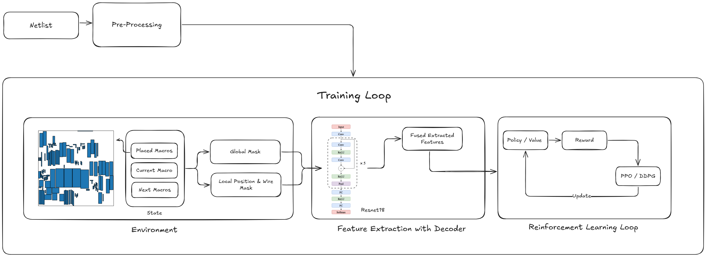
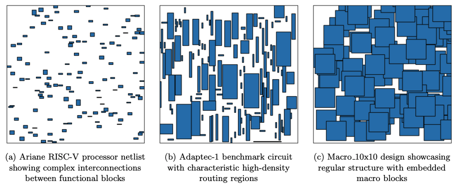
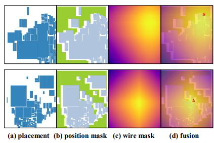
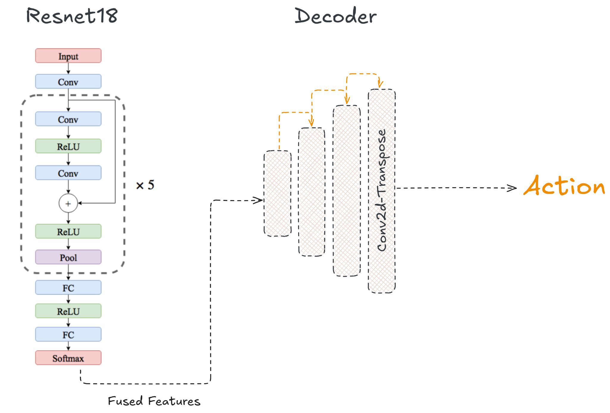
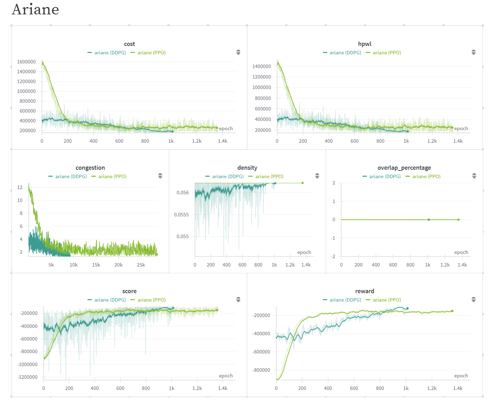
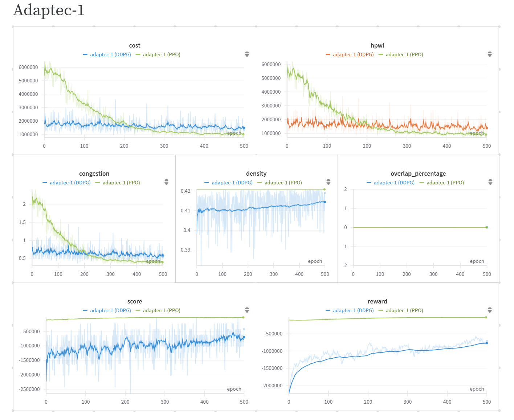
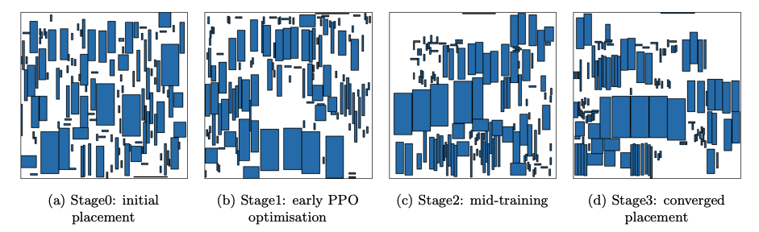
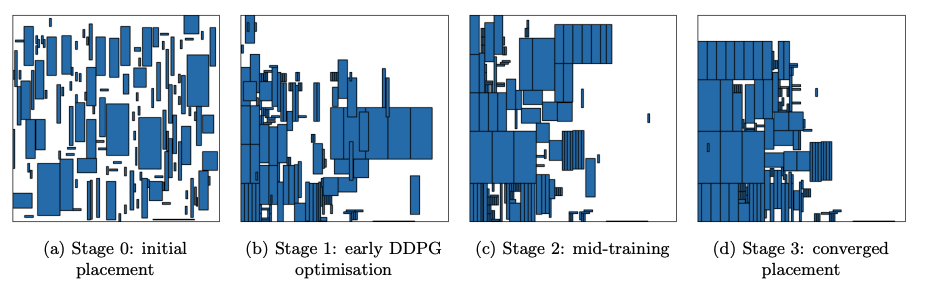

# PlaceRL: Fast Chip Placement via Reinforced Visual Representation Learning

A convolutional-encoder reinforcement learning framework for IC macro placement.

---

## Overview

PlaceRL formulates macro placement in VLSI design as a sequential decision-making problem and solves it using Deep Reinforcement Learning.

Unlike traditional hypergraph-only placers, PlaceRL integrates:

- **Pixel-mask state representation** for spatial reasoning
- **Convolutional feature extraction** (ResNet-18 backbone)
- **PPO and DDPG** reinforcement learning agents
- **Dense reward shaping** using HPWL, congestion, and density metrics

The system enables spatial reasoning over placement legality, routing congestion, and incremental wirelength cost.

---

## Reinforcement Learning Framework

The overall architecture is shown below:



The pipeline consists of:

1. **Netlist preprocessing** (hypergraph construction)
2. **Mask generation** (position, wire-cost, occupancy)
3. **Convolutional encoder** (global + local branches)
4. **PPO / DDPG training loop**
5. **Incremental reward computation**

---

## Target Netlists

We evaluate on three diverse benchmarks:

| Netlist | Description | Characteristics |
|---------|-------------|-----------------|
| **Ariane** | RISC-V CPU core | ~100k µm² macro area, 22k pins, 12k nets. Stress-tests fine-grained HPWL optimization |
| **Macro Tiles 10×10** | Synthetic high-utilization | 100 identical tiles, 250k µm², pin-sparse (1.2k pins, 540 nets). Tests global wirelength |
| **Adaptec1** | Heterogeneous SoC module | 543 macros, varied sizes (largest ~3.4M µm²). Tests overlap avoidance and density control |



---

## Mask-Based State Representation

Each placement step generates three masks that are processed by a two-path convolutional encoder:

| Mask | Purpose |
|------|---------|
| **Position Mask (fₚ)** | Binary grid marking legal placement sites (no overlap) |
| **Wire Mask (f_w)** | Continuous heat-map of ΔHPWL for each candidate cell |
| **View Mask (f_v)** | Global occupancy map showing placed modules |



---

## Convolutional Encoder Architecture

The encoder converts the three image-like masks into spatial features using a dual-branch architecture:

**Global Context Branch (ResNet-18):**
- Processes wire-cost and occupancy masks
- Captures long-range wiring tension and congestion hotspots
- Produces 512-d latent vector

**Local Fusion Branch:**
- 1×1 convolution stack preserving pixel-exact feasibility
- Retains sharp boundaries for legal placement sites



---

## Training Results

### Ariane Training (PPO)



Training dynamics showing:
- Rapid HPWL reduction
- Stable congestion control
- Smooth convergence over 1.5k iterations

---

### Adaptec-1 Training (PPO)



Demonstrates:
- Strong wirelength minimization
- No overlap violations
- Stable density management over 500 iterations

---

## Placement Progression

### PPO Placement Evolution (Adaptec-1)



Layout evolution from initial legalisation (Stage 0) to converged placement (Stage 3), with steady reductions in wire-length and congestion hotspots.

---

### DDPG Placement Evolution (Adaptec-1)



DDPG produces more efficient chip area utilization, reducing density hotspots and achieving lower overall wirelength.

---

## Experimental Results

### Performance Comparison

| Netlist | Algorithm | HPWL | Congestion | Cost | Density |
|---------|-----------|------|------------|------|---------|
| ariane | PPO | 179,802 | 1.626 | 192,917 | 0.056 |
| ariane | DDPG | 155,811 | 1.386 | 165,350 | 0.056 |
| macro tiles 10×10 | PPO | 546,999 | 1.006 | 596,144 | 0.233 |
| macro tiles 10×10 | DDPG | 772,953 | 0.981 | 822,122 | 0.238 |
| adaptec1 | PPO | 914,196 | 0.387 | 999,372 | 0.410 |
| adaptec1 | DDPG | 1,389,094 | 0.575 | 1,478,893 | 0.420 |

### Learning Efficiency

| Netlist | PPO Episodes | DDPG Episodes |
|---------|--------------|---------------|
| ariane | 1,000 | 1,300 |
| adaptec-1 | 500 | 1,500 |
| macros 10×10 | 800 | 4,000 |

### Computational Performance

| Metric | DDPG | PPO |
|--------|------|-----|
| Training Time (hours) | 2.1 | 1.2 |
| Memory Usage (GB VRAM) | 16 | 16 |
| Inference Time (s) | 0.82 | 0.77 |

---

## Optimization Metrics

The reward is computed using:

- **Half-Perimeter Wire Length (HPWL)** - Estimates total wire length
- **RUDY Congestion** - Routing difficulty based on net density
- **Density Overflow** - Cell distribution evenness

**Proxy Cost Function:**

```
Cost = W_wirelength × HPWL + W_density × Density + W_congestion × Congestion
```

**Incremental Reward:**

```
r_t = (HPWL_{t-1} - HPWL_t) - λ_cong|Cong_t - Cong_{t-1}| - λ_dens|Dens_t - Dens_{t-1}|
```

---

## Experimental Report

[Adaptec-1 and Ariane Experimental Results using DDPG and PPO](https://wandb.ai/zfyre-iit-roorkee/placerl/reports/Experimental-Results---VmlldzoxMjU3NjQwMg)

---

## Usage

You can start easily by using the following script:

```bash
cd maskplace
python PPO2.py
```

## Parameters

| Parameter | Description |
|-----------|-------------|
| `gamma` | Discount factor |
| `seed` | Random seed |
| `disable_tqdm` | Whether to disable the progress bar |
| `lr` | Learning rate |
| `log-interval` | Interval between training status logs |
| `pnm` | Number of place modules for each placement trajectory |
| `benchmark` | Circuit benchmark |
| `soft_coefficient` | Whether to constraint actions based on the wiremask |
| `batch_size` | Batch size |
| `is_test` | Testing mode based on the trained agent |
| `save_fig` | Whether to save placement figures |

---

## Benchmark

The repo has provided the benchmark *adaptec1* and *ariane*. For other benchmarks, you can download them from:

[ISPD 2005 Benchmarks](http://www.cerc.utexas.edu/~zixuan/ispd2005dp.tar.xz)

---

## Dependencies

- [Python](https://www.python.org/) >= 3.9
- [PyTorch](https://pytorch.org/) >= 1.10
- [gym](https://www.gymlibrary.dev/index.html) >= 0.21.0
- [matplotlib](https://matplotlib.org/) >= 3.7.1
- [tqdm](https://tqdm.github.io/)
- [protobuf](https://pypi.org/project/protobuf/) == 3.20 (for benchmark *ariane*)

---

## Key Contributions

- Hypergraph-based netlist encoding
- Pixel-mask state representation for spatial reasoning
- CNN-based policy architecture with dual-branch encoder
- Dual RL algorithm comparison (PPO vs DDPG)
- Benchmark evaluation on diverse chip layouts

---

## References

- [Chip Placement with Deep Reinforcement Learning](https://research.google/blog/chip-design-with-deep-reinforcement-learning/) (Google Research)
- [PPO: Proximal Policy Optimization Algorithms](https://arxiv.org/abs/1707.06347) (Schulman et al., 2017)
- [DDPG: Continuous Control with Deep Reinforcement Learning](https://arxiv.org/abs/1509.02971) (Lillicrap et al., 2015)
- [DeepTH: Chip Placement with Deep RL](https://doi.org/10.23919/DATE56975.2023.10137100) (DATE 2023)
- [ePlace: Electrostatics-based Placement](https://doi.org/10.1145/2593069.2593133) (DAC 2014)

---

## Future Work

- Hierarchical placement for large designs
- Transfer learning across different chip architectures
- Multi-GPU scaling for faster training
- Integration with routing engines
